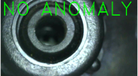
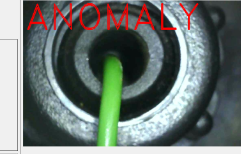

# **Anomaly-Detection-Autoencoder-GUI-ESP32-BT**
16\.10.24
develop: D:\ALL\_PROJECT\a\_Factory\\_AnomalyTF\py39tfe

Compressed doc: <https://www.youtube.com/watch?v=hJkR_GfMSZA>

Markdown generator: <https://products.aspose.app/words/conversion/word-to-md#google_vignette>

**Inspiration and motivation for this project**

All credits go to Dr. Sreenivas Bhattiprolu (https://github.com/bnsreenu ). His code examples were very helpful for my anomaly detection experiment.

I was motivated to delve so deeply into this by Yannick Koss. Yannick posed the question "***is it possible to detect anomalies in objects WITHOUT error-learning material**?*" Objects can be anything - e.g. motor or pump or similar.

And so we started this experiment in summer 2024.

**TASK / GOAL:**

A pump body has 2 states: Error YES or Error No

We have to determine whether the pump body is faulty. In the further testing process, the faulty pump is then sorted out.

|**Error-Free**|**Defective ( ANOMALY )**|
| :-: | :-: |
|||

**Procedure:**

The experiment is a practical task - quality control (small series). In such an environment, there is not enough "learning material" for classic machine learning. It is also not always 100% certain WHICH error occurs in order to then learn it across the board (at least 1000 images). So we decided to use the auto-encoder for such anomaly detection.

In this process, the error-free object is trained (learned).

      

**

**Training of Error-Free/Good Object Images:**

Internal doc:
D:/ALL\_PROJECT/a\_Factory/\_AnomalyTF/py39tfe/cam2TrainImages
Code: \_cam2trainImage.py
project structure in spyder:

The setup is extremely simple to create suitable training material. We decided to use a USB microscope to take detailed photos of the pump body (available inexpensively from Amazon, eBay, etc.).

  
At the end, the training images should be saved in a folder:

\_cam2trainImage.py ist he python code to generate and store those images

 
The 1 stands for the external CAM. In our case it is the USB-Microscope-cam! The cam can be started with Start/Stop.
      

With *delete Train-Images* the old images are completely deleted from the folder. With Enable/ImageStoring the saving of the individual images starts. The small counter shows us the current number of saved images.

It was cloned from **Movie2Cartoon** and slightly modified. These filters (e.g. adaptive threshold,..) could be applied, but they are not important here. We only create the training images here and save them in the images4training folder.

**Variances / Best practice**

We had the best results when we moved the object a little while taking the images. Sometimes there was a shadow or light effect. The aim is to record the error-free object well but with variations. We achieved good results with 500 - 1000 images.

copyNpaste:

we copy the training images we created (Error-Free) into the corresponding folder of \_autoencoderGui.py

In our spyder structure here:

errorfree\_train:

`  `       è              

During the MODEL creation process, it is helpful to copy a few images into the errorfree\_train folder. Images from the errorfree\_train folder but with some variation if possible! - around 150 pieces

There are passages in the code that allow you to immediately identify a defect. This way, the MODEL or RECONSTRUCTION can be tested as part of the MODEL generation:

A few error images are recorded for this purpose. These are then placed in the DEFECT folder.

        

**IMPORTANT to understand!**

**These defect images are ONLY used to test the model or to detect an ANOMALY – training is ONLY carried out on error-free material! BUT to avoid errors during MODEL generation, it is better to have images in ALL image folders!**

**

**Make the MODEL / 1\_anomaly\_make\_h5\_Model.py**

Based on the errorfree\_train images, the h5 model is built ('model\_anomalyFinal.h5')
In spyder, make sure that we are in the right environment! In my case, python 3.9

the code should be executed in the correct working directory:

       

..should start and take a long time!

At the end, 2 plots are shown in spyder: validationLoss & simple prediction

Result:

Autoencoder Model: *model\_encodeDecode.h5*
MODEL of encoder network, with trained weights : *model\_anomalyFinal.h5*

**Autoencoder / RUN / \_autoencoderGui\_BT.py**

Everything above is a prerequisite! If fulfilled we start \_autoencoderGui\_BT.py

 start the  webCam

  

These threshold fields can be adjusted manually!

Density and Reconstruction-Err are the two most important thresholds - THESE are determined as follows:
The ERROR-FREE test piece is clamped while the CAM is running:
  

The above if formula appears in the status line. This is where the test setup is CALIBRATED. The threshold values ​​for **anomaly** and no anomaly are set.

***density < density\_threshold and reconstruction\_accurancy > reconstruction\_error\_threshold***

These two values ​​are recalculated each cycle and compared with the stored threshold values. The result determines whether an anomaly is present.

If **ANOMALY** is displayed for an error-free test object in this calibration phase, the corresponding threshold field must be changed... until **NO ANOMALY** is displayed.

If the threshold values ​​are set correctly, the model takes effect:

   

**Remote threshold adaption via ESP32 and BT ( classic ):**
internal/code location: 
D:\ALL\_PROJECT\VS\_vMicro\_ESP\ES32\_2024\simpleWifiScan\btSerial\_Python
Fritzing:  D:\ALL\_PROJECT\a\_Factory\\_AnomalyTF\py39tfe\ad\_BT\_serial\_dataTransfer\schaltplan
development: VS2019 /vMicro/ ESP32 / BT classic

It's more of a gimmick. We thought it would be nice to add some extra hardware to the pure software GUI dashboard.
power supply via USB cable!

The potentiometer values ​​for density and reconErr are sent to AnomalyDetection via BT and displayed there. The display value "varies" somewhat unstably. It has already been smoothed out somewhat with a 1uF capacitor..You have to do another look at that! The desired threshold value can then be transferred to the dashboard using the "grap-hand".

**

**Prerequisit / skills / Sources / THANKS!**

**My environment:**

|Acer Nitro 5 / GTX 1660 Ti (GPU available)|
| :- |
|Anaconda 3|
|Payton 3.9tf**e**   anaconda     ( a clove from py39tf ) e == ENCODER|
|Spyder Editor|
|opencv 4.6.0        ( problem with conda install..mus use pip !! )  pip install opencv-contrib-python    / <https://stackoverflow.com/questions/23119413/how-do-i-install-python-opencv-through-conda>|
|spy 5.5.1|
||
|CUDA 11.2 and cuDNN 8|
|2019 Visual Studio|
||
|Word File English Translation with ASPOSE|
|

GTX 1660TI “Tuning sm\_75”
|

|
<https://www.youtube.com/watch?v=1GUgD2SBl9A>

|95 - What is digital image filtering and image convolution?|
| :- | :- |
|
<https://www.youtube.com/watch?v=ccdssX4rIh8>

|ImageDataGenerator:  127 - Data augmentation using keras|
|
 <https://www.youtube.com/watch?v=q_tpFGHiRgg&list=PLZsOBAyNTZwYE5IM1g_3yNXuxaH_QRSoJ&index=3>

 
|YT:     260 - Identifying anomaly images using convolutional autoencoders|
|
Kernel density estimation ( KDE ) – wahrscheinlichkeit berechnen das object zur „GOOD class“ gehört

|KDE|
|

<https://www.youtube.com/watch?v=JoR5HCs0n0s>

|Autoencoders in Python with Tensorflow/Keras|
|
<https://www.youtube.com/watch?v=YV9D3TWY5Zo>

|
178 - An introduction to variational autoencoders (VAE)

179 - Variational autoencoders using keras on MNIST data

<https://www.youtube.com/watch?v=8wrLjnQ7EWQ>

|
|
**<https://stackoverflow.com/questions/75905219/how-to-send-a-data-from-esp8266-arduino-to-pc-python-over-wifi>**

|Esp  - daten -> python via http server|
|
<https://stackoverflow.com/questions/64834709/send-data-through-usb-port-to-esp32-with-python>

|Send data through usb port to esp32 with python|
|
<https://www.youtube.com/watch?v=RaMc3s7xhns>

|
PYTHON | Send DATA between Raspberry Pi and PC

Socket  Server
|

